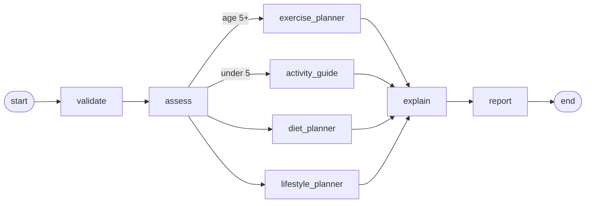

# BMIPilot AI: Design

This document explains *why* the agent is shaped the way it is: the assessment methods,
the control flow, the state model, the safety decisions, and the trade-offs.

---

## 1. Problem

Give anyone, from a newborn to a 150-year-old, a **correct** BMI assessment and a short,
**age-appropriate** plan for activity, diet and lifestyle.

Two failure modes drive the design:

1. **Wrong maths for the age.** Adult BMI cut-offs are meaningless for children, whose
   normal BMI changes with age and sex. A calculator that labels a 9-year-old with BMI 20.9
   as "Normal" is wrong (he is at the 94.6th percentile, i.e. overweight).
2. **Unsafe advice.** An LLM asked for a "diet tip" will happily suggest calorie restriction
   for a toddler or plyometrics for an 82-year-old with obesity.

The design goal: **numbers from code, words from the LLM, guardrails from code.**

## 2. Assessment: three methods

| Age | Reference | Why |
|---|---|---|
| 0 to < 2 years | WHO Child Growth Standards, BMI-for-age, **daily** LMS rows (0-731 days) | CDC recommends WHO standards under 2; daily rows make day-1 newborns accurate (the median rises fast in the first weeks) |
| 2 to < 20 years | CDC 2000 BMI-for-age, half-month LMS rows | US/clinical standard for children and teens; defines overweight (P85) and obesity (P95) |
| 20 years and over | WHO adult classification | Standard adult cut-offs, plus a severe-thinness class below 16 |

**LMS method.** For each age and sex the tables give L (Box-Cox power), M (median) and
S (coefficient of variation). Then `z = ((BMI/M)^L - 1) / (L*S)` and the BMI at any z (or
percentile) is `M * (1 + L*S*z)^(1/L)`. Parameters are linearly interpolated between rows.

**WHO tails.** Beyond ±3 SD, WHO uses a restricted rule that keeps the z-scale linear in the
tails; it is implemented in `growth.who_z_score`.

**Severe obesity in children.** Percentiles above ~P97 are unreliable from the 2000 LMS
parameters, so CDC classifies severe obesity as a **percentage of the 95th percentile**:
class 2 at ≥ 120%, class 3 at ≥ 140%.

**Healthy range.** Adults: BMI 18.5-24.9. Children 2-19: P5-P85. Under 2: -2 SD to +1 SD.
The range is converted to a weight range for the person's height. Only adults get a
"kg to the healthy range" target; children never get weight-loss targets.

**Validation.** `Profile` rejects unit mistakes (height 157 instead of 1.57), ages outside
0-150, missing sex under 20, and any BMI outside 7-150 (almost certainly wrong units).

All of this is pure Python, covered by tests that compare the LMS maths with values
published by WHO and CDC.

## 3. Control flow

| Node | LLM | Responsibility |
|---|---|---|
| `validate` | — | Re-validates the profile inside the graph (the graph can be invoked directly). |
| `assess` | — | Deterministic assessment with the age-appropriate method. |
| `exercise_planner` | yes + tool | LLM picks exercise type/difficulty (forced tool call), the policy corrects the arguments, the tool searches API Ninjas, the LLM writes 2-3 exercises from the results. |
| `activity_guide` | — | Under-5s: WHO play-based activity guidance; no gym exercises. |
| `diet_planner` | yes | One structured `Tip` (tip + why). |
| `lifestyle_planner` | yes | One structured `Tip` about sleep, screen time, hydration or routines. |
| `explain` | yes | ≤ 3 sentences connecting the result to the recommendations. |
| `report` | — | Markdown report with metrics, plan, notes, warnings and disclaimer. |

**Parallelism.** `assess` fans out to one activity branch (chosen by `route_activity`) plus
the diet and lifestyle branches. They run in the same LangGraph super-step, so `explain`
runs exactly once, after all three have finished. Wall-clock time is the slowest branch,
not the sum.

## 4. State model

`GraphState` (a `TypedDict`) keeps the inputs and outputs as plain JSON:

- **Input:** `profile` (a validated `Profile`, stored with `model_dump()`)
- **Assessment:** `assessment` (an `Assessment`)
- **Plan:** `exercise_plan`, `exercises`, `diet_tip`, `lifestyle_tip`, `explanation`, `report`
- **Warnings:** `Annotated[list[str], operator.add]`. Parallel branches may append in the
  same step, so the field needs a reducer.

Because everything is JSON-serialisable, a checkpointer or a trace can store and replay any run.

## 5. Safety policy (in code, not just in prompts)

| Rule | Where |
|---|---|
| Children, teens, older adults (65+) and High/Very-high risk get **beginner, low-impact** exercises (cardio or stretching) | `policy.apply_safety_policy` rewrites the LLM's tool arguments before the tool runs |
| Under-5s never reach the exercise tool | conditional edge `route_activity` |
| No dieting, calorie restriction or weight-loss targets for children; write for the parent/caregiver | `policy.STAGE_GUIDANCE` in every prompt + `weight_to_healthy_kg = None` for children |
| Older adults: protein, muscle, balance; no aggressive weight loss | `STAGE_GUIDANCE` + assessment note |
| Disclaimer on every report and in the UI | `policy.DISCLAIMER` |

Prompts tell the model the rules; code makes sure the rules hold even when the model ignores them.

## 6. Tool design

- **Enum-typed arguments** (`Literal` types in a Pydantic `args_schema`), so the tool schema
  sent to the model lists the valid values.
- **Forced tool call** (`tool_choice="get_exercise_plan"`), so the plan is grounded in the
  database instead of invented.
- **Trimmed output**: only name, type, muscle, equipment and difficulty, at most 5 rows. The raw
  API returns long instructions that would multiply the tokens in the follow-up call.
- **Cached**: there are only a few type/difficulty pairs, so successful responses are cached
  per process; HTTP retries with backoff for 429/5xx.
- **Graceful degradation**: any provider failure becomes an `{"error": ...}` tool result, so
  the LLM falls back to a safe generic activity and the report shows a warning.
- **Injectable**: `build_graph(llm, exercise_search)` takes any search function, which is how the
  tests run offline.

## 7. Interfaces

One service (`BMIPilotService.assess` / `.coach`) is shared by the CLI, the FastAPI app and,
through the API, the Streamlit dashboard. `/assess` is instant and free (no LLM), which lets
the dashboard draw the chart immediately; `/coach` runs the agent. The dashboard's three age
groups map one-to-one to the three methods, each with its own chart:

- **0-2 years:** WHO z-score curves (-2, 0, +1, +2 SD) with the healthy zone shaded.
- **2-19 years:** CDC percentile curves (5th, 50th, 85th, 95th) with the healthy zone shaded.
- **20+ years:** the WHO adult categories as a diverging scale around "Normal".

## 8. Trade-offs and future work

- **BMI is a screening measure**, not a body-composition measure. Waist-to-height ratio would
  be a valuable second signal.
- **Adult cut-offs are population-dependent** (WHO suggests lower thresholds for Asian
  populations); a configurable cut-off set is on the roadmap.
- **CDC vs WHO for 2-19.** Many countries use the WHO 2007 reference (5-19 years) instead of
  CDC. The method lives behind `assessment._child`, so swapping or making it configurable is local.
- **LLM tips are not evaluated offline yet.** An eval set checking safety and age-appropriateness
  (e.g. "no calorie targets for under-18s") would turn the prompt rules into measured guarantees.
