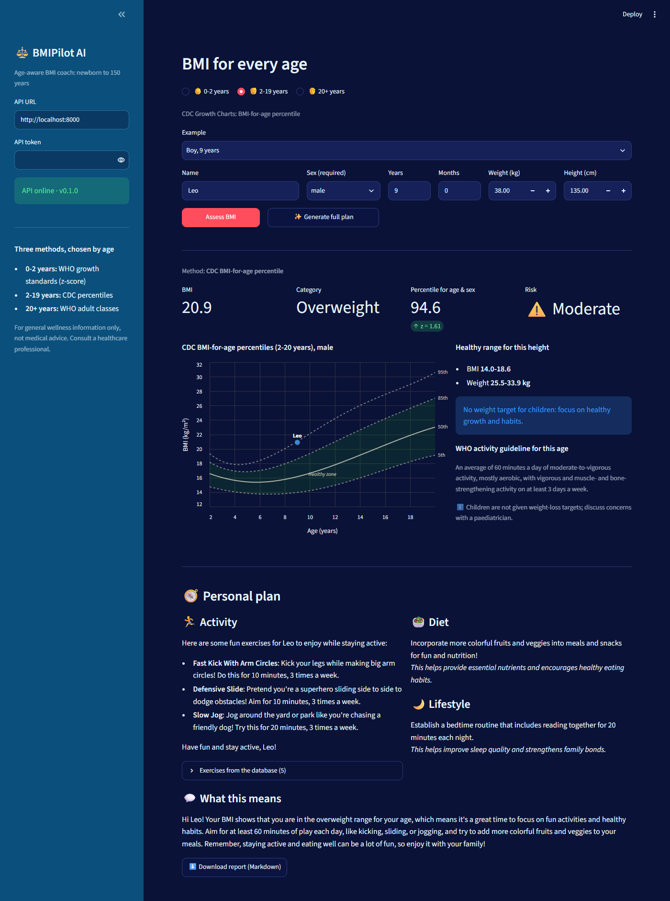
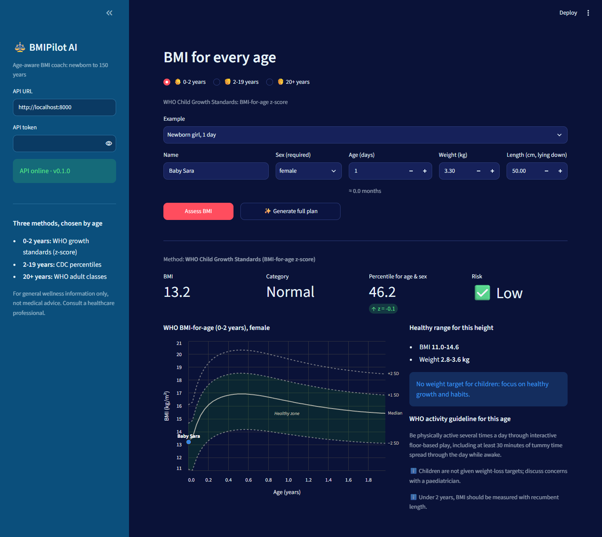
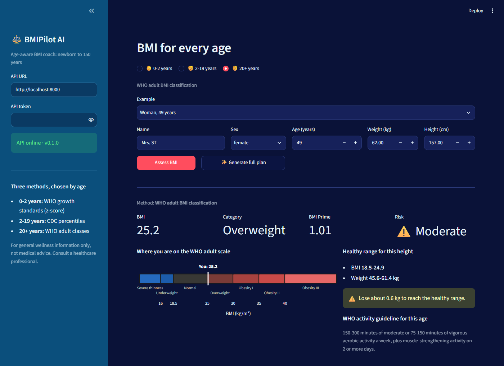
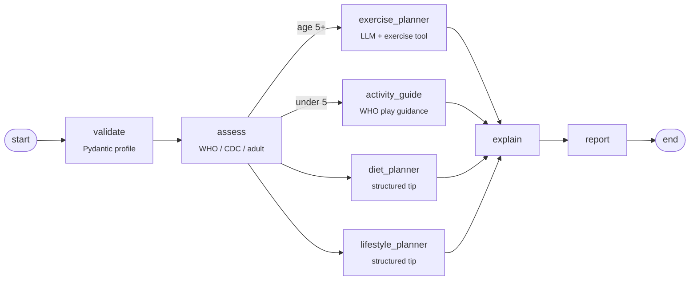
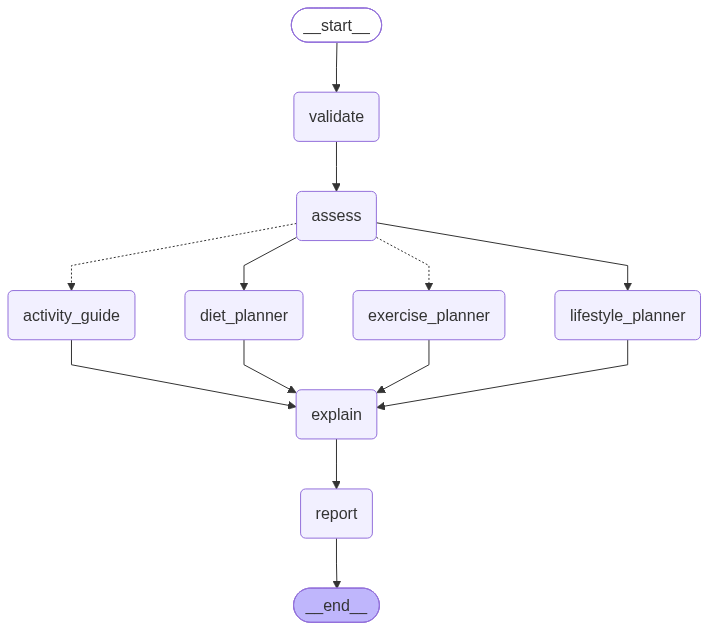

# BMIPilot AI

### An age-aware, tool-using BMI health coach built on LangGraph: from newborns to 150 years

[](https://github.com/Hadi2468/BMIPilot-AI/actions/workflows/ci.yml)
[](https://www.python.org/)
[](https://github.com/langchain-ai/langgraph)
[](LICENSE)

Most BMI calculators apply the adult cut-offs to everyone. That is wrong for anyone under 20:
a BMI of 20.9 is *normal* for a 49-year-old but *overweight* for a 9-year-old boy.

BMIPilot AI picks the **scientifically correct method for the person's age and sex**,
computes the assessment **deterministically in code**, and then runs a **parallel LangGraph
agent** that searches an exercise database and writes an age-appropriate exercise, diet and
lifestyle plan, with safety rules enforced in code, not just in the prompt.


*The BMIPilot AI dashboard (2-19 years: CDC percentile chart and personal plan)*

---

## 📏 Three methods, chosen by age

| Age group | Method | Output |
|---|---|---|
| **0 - 2 years** | [WHO Child Growth Standards](https://www.who.int/tools/child-growth-standards), BMI-for-age (daily LMS tables) | z-score, percentile, WHO category (wasted ... obese) |
| **2 - 19 years** | [CDC 2000 Growth Charts](https://www.cdc.gov/growthcharts/), BMI-for-age (sex-specific LMS) | percentile, category, severe obesity as % of the 95th percentile |
| **20 - 150 years** | WHO adult classification | category (thinness ... obesity class III), BMI Prime, kg to the healthy range |

Children's curves are sex-specific, so **sex is required under 20**. The LMS implementation
is tested against the values WHO and CDC publish (to 0.01 BMI).

| 👶 0-2 years | 🧑 20+ years |
|---|---|
|  |  |

---

## ✨ Highlights

| Capability | How |
|---|---|
| **Correct&nbsp;for&nbsp;every&nbsp;age** | WHO (0-2), CDC (2-19) and WHO adult (20+) methods; ages in days, months or years |
| **Deterministic&nbsp;assessment** | BMI, z-score, percentile, category, risk and healthy weight range are computed in Python, never by the LLM |
| **Parallel&nbsp;agent** | Exercise, diet and lifestyle branches run concurrently, then fan in to one explanation |
| **Conditional&nbsp;routing** | Under-5s get WHO play-based activity guidance; no gym-exercise tool call |
| **Safety&nbsp;in&nbsp;code** | Children, teens, older adults and high-risk users always get beginner, low-impact exercises, whatever the LLM asks for; no weight-loss targets for children |
| **Safe&nbsp;tool&nbsp;calling** | Enum-typed tool arguments, forced tool call, trimmed and cached results |
| **Graceful&nbsp;degradation** | If the exercise API fails, the agent falls back to a safe generic activity and records a warning |
| **Input&nbsp;validation** | Catches unit mistakes (e.g. height `157` instead of `1.57`) and implausible BMIs |
| **Three&nbsp;interfaces,&nbsp;one&nbsp;service** | CLI, FastAPI (bearer-token auth) and a Streamlit dashboard share a single service layer |
| **Tested&nbsp;offline** | pytest suite with an injected fake LLM and exercise search: no API keys, no network, no cost; CI on every push |

---

## 🔀 Architecture



<details>
<summary>Rendered by LangGraph</summary>


</details>

See **[DESIGN.md](DESIGN.md)** for the method details, state design, safety policy and trade-offs.

---

## 🚀 Quickstart

```bash
git clone https://github.com/Hadi2468/BMIPilot-AI.git
cd BMIPilot-AI
python -m venv .venv && source .venv/bin/activate    # Windows: .venv\Scripts\activate
pip install -e ".[api,dashboard,dev]"
cp .env.example .env                                 # add OPENAI_API_KEY and NINJAS_API_KEY
```

### 1. CLI

```bash
bmipilot                                                               # sample adult
bmipilot --name Sara --sex female --age 35 --weight 70 --height 1.65
bmipilot --name Leo --sex male --age 9 --weight 38 --height-cm 135
bmipilot --name Baby --sex female --age-days 1 --weight 3.3 --height-cm 50
bmipilot --sex male --age-months 18 --weight 11 --height-cm 82 --bmi-only   # no LLM, instant
bmipilot --json --output outputs/run.json --save-graph assets/graph.png
```

### 2. REST API

```bash
uvicorn bmipilot.api:app --reload        # interactive docs at http://localhost:8000/docs
```

| Method | Endpoint | Purpose |
|---|---|---|
| `GET` | `/health` | Liveness check |
| `POST` | `/assess` | Deterministic assessment for any age (no LLM, instant) |
| `POST` | `/coach` | Full agent run: assessment + exercise, diet and lifestyle plan + report |
| `GET` | `/reference/{WHO\|CDC}/{female\|male}` | Growth curves for charts |

```bash
curl -X POST localhost:8000/assess -H "Content-Type: application/json" \
     -d '{"name": "Leo", "age_years": 9, "sex": "male", "weight_kg": 38, "height_m": 1.35}'
```

Set `BMIPILOT_API_TOKEN` to require `Authorization: Bearer <token>`.

### 3. Streamlit dashboard

```bash
streamlit run dashboard/app.py            # talks to the API at BMIPILOT_API_URL
```

Pick an age group (**0-2**, **2-19**, **20+**), start from an example or enter your own values,
click **Assess BMI** for the instant chart, or **Generate full plan** for the agent.

### 4. Docker

```bash
docker compose up --build                 # API on :8000, dashboard on :8501
```

---

## 📊 Sample runs

Real output from `gpt-4o-mini` (about 7 s per full run):

| Person | Method | BMI | Result | Plan highlights |
|---|---|---|---|---|
| Girl, **1 day**, 3.3 kg, 50 cm | WHO z-score | 13.2 | Normal (percentile 46, z -0.1) | Play-based guidance, tummy time, responsive feeding; no exercise tool call |
| Boy, **9 years**, 38 kg, 135 cm | CDC percentile | 20.9 | Overweight (percentile 94.6) | Beginner cardio from the database, made playful; family habits, no weight target |
| Woman, **49 years**, 62 kg, 157 cm | WHO adult | 25.2 | Overweight (BMI Prime 1.01) | Beginner cardio, whole-food diet tip, sleep routine; lose ~0.6 kg to the healthy range |
| Man, **82 years**, 95 kg, 170 cm | WHO adult | 32.9 | Obesity class I | Policy forced beginner cardio; the LLM judged the results unsafe and switched to brisk walking, chair-based and balance exercises; protein-rich diet tip |

---

## 🧪 Testing

```bash
ruff check .

pytest          # fully offline
```

The LLM and the exercise search are **dependency-injected**, so tests swap in scripted fakes
and assert on behavior: the LMS maths against published WHO/CDC values, every category
boundary, validation of unit mistakes, the conditional under-5 branch, the safety policy
overriding risky tool arguments, API-failure degradation, and the API contract (auth, 422).

---

## 🗂️ Project structure

<pre>
<b>BMIPilot-AI/</b>
├── src/bmipilot/
│   ├── data/bmi_for_age_lms.csv   # WHO (0-2y, daily) + CDC (2-20y) LMS tables
│   ├── growth.py          # LMS maths: z-score, percentile, curves
│   ├── assessment.py      # the three methods, categories, risk, healthy range
│   ├── policy.py          # WHO activity guidelines, audience rules, safety policy
│   ├── schemas.py         # Profile, Assessment, Tip, CoachResult
│   ├── prompts.py         # all prompt templates
│   ├── state.py           # GraphState (TypedDict)
│   ├── nodes.py           # validate / assess / planners / explain / report
│   ├── graph.py           # graph assembly with dependency injection
│   ├── tools/exercises.py # API Ninjas adapter + LLM tool (swappable)
│   ├── report.py          # Markdown report
│   ├── llm.py · config.py · observability.py
│   ├── service.py         # assess / coach
│   ├── api.py             # FastAPI app
│   └── cli.py             # <b>bmipilot</b> command
├── dashboard/app.py       # Streamlit UI (API client)
├── tests/                 # offline pytest suite
├── Dockerfile · docker-compose.yml
└── .github/workflows/ci.yml
</pre>

---

## ⚙️ Configuration

| Variable | Default | Purpose |
|---|---|---|
| `OPENAI_API_KEY` | — | Required for the agent (not for `/assess` or `--bmi-only`) |
| `NINJAS_API_KEY` | — | Exercise database; the agent degrades gracefully without it |
| `LANGSMITH_TRACING` / `LANGSMITH_API_KEY` | `false` | Optional tracing |
| `BMIPILOT_OPENAI_MODEL` | <code>gpt&#8209;4o&#8209;mini</code> | Model for all LLM nodes |
| `BMIPILOT_TEMPERATURE` | `0.2` | Low: health advice should be consistent |
| `BMIPILOT_MAX_EXERCISES` | `5` | Exercises returned to the LLM |
| `BMIPILOT_API_TOKEN` | *(empty)* | Set to enable bearer auth on the API; empty = no auth |

---

## ⚠️ Disclaimer

BMIPilot AI is for general wellness information and education only. It is **not medical
advice** and not a diagnostic tool. BMI does not account for muscle mass, body composition,
pregnancy or medical conditions. Consult a healthcare professional, and a paediatrician for
children, before starting a new exercise or diet programme.

---

## 🛣️ Roadmap

➡️ Population-specific adult cut-offs (e.g. WHO Asian BMI thresholds)  
➡️ Waist-to-height ratio as a second, body-composition-aware measure  
➡️ Growth tracking over time: multiple measurements per child on one chart  
➡️ Offline evaluation set for the LLM tips (safety and age-appropriateness)  

---

## 📚 Data sources

- WHO Child Growth Standards, BMI-for-age expanded tables (boys and girls, 0-5 years).
- CDC 2000 Growth Charts, BMI-for-age LMS parameters (`bmiagerev.csv`, 2-20 years).
- WHO guidelines on physical activity: under-5s (2019) and all ages 5+ (2020).
- Exercise database: [API Ninjas Exercises API](https://api-ninjas.com/api/exercises).

---

## License

MIT

---
## 🧑🏻‍💻 Author
<pre>
<b> Hadi Hosseini </b>    
 AI/ML Engineer | Data Engineer | Biomedical Data Scientist  
 www.linkedin.com/in/hadi468
</pre>
